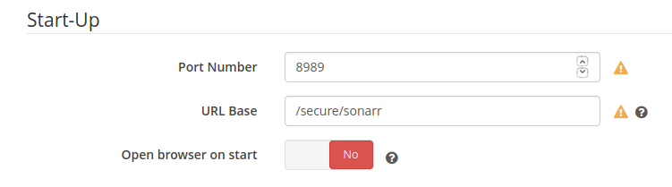

Simple docker compose setup for sabnzbd / radarr / sonarr all behind an apache proxy to handle authentication.

Assumes that something is proxying port 8081 -> /secure, ie this in the httpd running on the host:
```ProxyPass "/secure/" "http://localhost:8081/"
ProxyPassReverse "/secure/" "http://localhost:8081/"
```

Assumes you already storage mounted externally, ie

```
docker volume create \
  --driver local \
  --name thunderdome-downloads \
  --opt type=cifs \
  --opt device=//192.168.1.1/share/downloads \
  --opt o=iocharset=utf8,username=mount,password=baloney,domain=workgroup,uid=1,gid=1,file_mode=0775,dir_mode=0775
```

if you're connecting to a synology which is serving CIFS.

Set up passwords via `htpasswd` ie `sudo htpasswd -c apache-proxy/passwords mongoose`

Start everything via `docker-compose up -d --build` (build is optional, but necessary if you've made any changes to the apache proxy)

You'll need to set up sonarr/radarr to understand the path that they exist in, ie:


